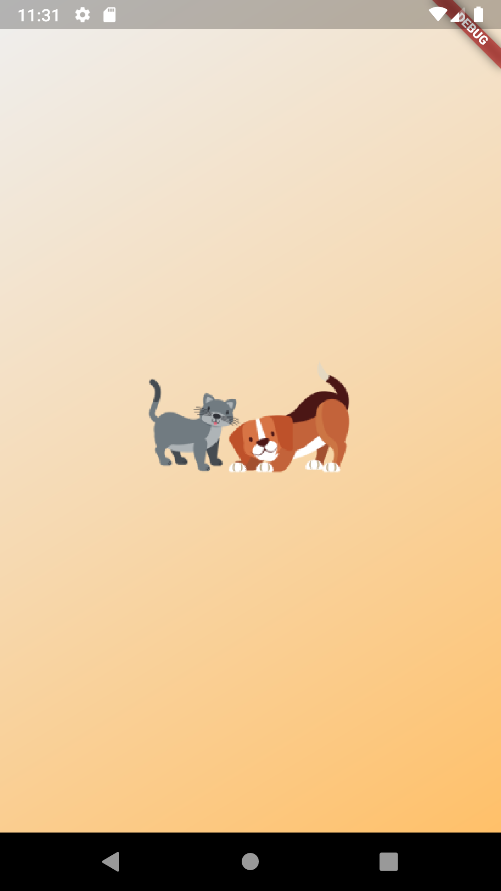

## **PetShop**

Aplicativo para agendamento de serviços para **petshop** desenvolvido na disciplina de Desenvolvimento para Sistemas Móveis.

**Grupo 4:**  
         Caroline Knaip Diniz  
         Diego de Oliveira Pinheiro  
         Milena de Oliveira 

**Professor orientador:** José Matias Lemes Filho

Projeto desenvolvido no **figma**: [PetShop - Mobile](https://www.figma.com/file/CDfhEDngnpQmsR6SYw2ztT/Mobile-PetShop?node-id=0%3A1)

### **Splash Page do aplicativo**

___
Análise e Desenvolvimento de Sistemas - USF Itatiba 
